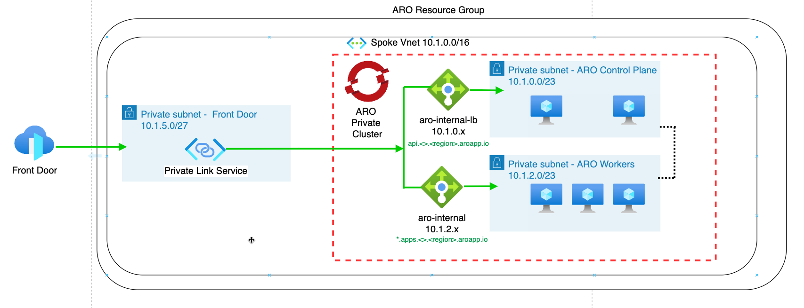

# Azure Front Door Integration with Azure Red Hat OpenShift (ARO)

This guide demonstrates how to expose applications running on an Azure Red Hat OpenShift (ARO) cluster using Azure Front Door. We'll cover both public and private cluster scenarios with detailed step-by-step instructions.

## Overview

Azure Front Door is a global, scalable entry-point that uses the Microsoft global edge network to create fast, secure, and highly scalable web applications. When integrated with ARO, it provides several benefits:

* **Enhanced Security**: WAF and DDoS protection, certificate management, and SSL offloading
* **Global Edge Access**: Traffic is controlled at Microsoft's edge before entering your Azure environment
* **Private Infrastructure**: Your ARO cluster and Azure resources can remain private even when services are publicly accessible

## Architecture



In this architecture:
- Azure Front Door sits at the edge of Microsoft's network
- Traffic is routed through Azure Front Door to your ARO cluster
- For private clusters, Front Door connects via an Azure Private Link service
- For public clusters, Front Door can connect directly to public endpoints

## Prerequisites

- An Azure Red Hat OpenShift (ARO) cluster (public or private)
- Access to Azure CLI and OpenShift CLI (oc)
- A deployed application on the ARO cluster (like the microsweeper app from the workshop)
- Administrative access to your Azure subscription

## Environment Variables Setup

Before starting with Azure Front Door deployment, we need to set up the necessary environment variables. These variables will be used throughout the implementation process.

### Core Environment Variables

```bash
# Set these variables according to your environment
export AZ_USER="<your-username>"            # Your assigned username (e.g., user1)
export AZ_RG="${AZ_USER}-rg"                # Resource group name
export AZ_ARO="${AZ_USER}-cluster"          # ARO cluster name
export AZ_LOCATION="eastus"                 # Azure region
export UNIQUE="$(openssl rand -hex 4)"      # Unique identifier for resources

# Domain and Front Door variables
export CUSTOM_DOMAIN="${AZ_USER}.example.com"  # Your custom domain
export FRONTDOOR_NAME="${AZ_USER}-fd"          # Name for Front Door profile
export ENDPOINT_NAME="${AZ_USER}-endpoint"     # Front Door endpoint name
export ORIGIN_GROUP="${AZ_USER}-origins"       # Origin group name

# OpenShift variables
export NAMESPACE="microsweeper-ex"             # Application namespace
export APP_SERVICE="microsweeper-appservice"   # Application service name
export APP_DOMAIN="app.${AZ_USER}.example.com" # App subdomain
```

### OpenShift Login and Project Configuration

Before working with your ARO cluster, you need to authenticate and set the correct project context:

#### Step 1: Get OpenShift Credentials and URLs

```bash
# Get OpenShift console URL
export OCP_CONSOLE="$(az aro show --name ${AZ_ARO} \
  --resource-group ${AZ_RG} \
  -o tsv --query consoleProfile)"

# Get OpenShift API server URL
export OCP_API="$(az aro show --name ${AZ_ARO} \
  --resource-group ${AZ_RG} \
  --query apiserverProfile.url -o tsv)"

# Get cluster credentials (admin)
ADMIN_CREDENTIALS=$(az aro list-credentials \
  --name "${AZ_ARO}" \
  --resource-group "${AZ_RG}")

export OCP_USER=$(echo $ADMIN_CREDENTIALS | jq -r '.kubeadminUsername')
export OCP_PASS=$(echo $ADMIN_CREDENTIALS | jq -r '.kubeadminPassword')

# Display the information
echo "=================================================="
echo "OPENSHIFT CLUSTER INFORMATION"
echo "=================================================="
echo "Console URL: ${OCP_CONSOLE}"
echo "API Server: ${OCP_API}"
echo "Username: ${OCP_USER}"
echo "Password: ${OCP_PASS}"
echo "=================================================="
```

#### Step 2: Login to OpenShift CLI

```bash
# Login to OpenShift using the CLI
echo "🔐 Logging into OpenShift cluster..."
oc login "${OCP_API}" -u "${OCP_USER}" -p "${OCP_PASS}"

# Verify login was successful
if [ $? -eq 0 ]; then
    echo "✅ Successfully logged into OpenShift cluster"
    echo "Current user: $(oc whoami)"
    echo "Current server: $(oc whoami --show-server)"
else
    echo "❌ Failed to login to OpenShift cluster"
    echo "Please verify the credentials and try again"
    exit 1
fi
```

#### Step 3: Set Up Project/Namespace

```bash
# Check if the project exists
if oc get project $NAMESPACE >/dev/null 2>&1; then
    echo "📁 Project '$NAMESPACE' already exists"
    oc project $NAMESPACE
else
    echo "📁 Creating new project '$NAMESPACE'..."
    oc new-project $NAMESPACE --description="Microsweeper application for Front Door integration"
fi

# Verify current project context
CURRENT_PROJECT=$(oc project -q)
echo "Current project: $CURRENT_PROJECT"

if [ "$CURRENT_PROJECT" != "$NAMESPACE" ]; then
    echo "⚠️  Warning: Current project ($CURRENT_PROJECT) does not match expected project ($NAMESPACE)"
    echo "Switching to correct project..."
    oc project $NAMESPACE
fi

echo "✅ Project setup completed successfully"
```

#### Alternative: Login with Token (More Secure for Automation)

For automation scripts or CI/CD pipelines, using tokens is more secure:

```bash
# Alternative method: Login with token
login_with_token() {
    echo "🔐 Logging into OpenShift with token..."
    
    # Get token from the console or use a service account token
    if [ -z "$OCP_TOKEN" ]; then
        echo "📋 To get a token, visit: ${OCP_CONSOLE}"
        echo "   1. Login to the web console"
        echo "   2. Click on your username (top right)"
        echo "   3. Select 'Copy Login Command'"
        echo "   4. Copy the token from the command"
        echo ""
        read -p "Enter your OpenShift token: " OCP_TOKEN
    fi
    
    # Login with token
    oc login --token="$OCP_TOKEN" --server="$OCP_API"
    
    if [ $? -eq 0 ]; then
        echo "✅ Successfully logged in with token"
    else
        echo "❌ Failed to login with token"
        return 1
    fi
}

# Uncomment the line below to use token-based authentication
# login_with_token
```

#### Step 4: Verify Cluster Access and Permissions

```bash
# Verify cluster access and permissions
echo "🔍 Verifying cluster access and permissions..."

# Check if we can list projects
echo "Available projects:"
oc get projects | head -10

# Check permissions in current project
echo ""
echo "Permissions in current project ($NAMESPACE):"
oc auth can-i --list --namespace=$NAMESPACE | head -10

# Check if we can create resources
echo ""
echo "Testing resource creation permissions:"
oc auth can-i create pods --namespace=$NAMESPACE && echo "✅ Can create pods" || echo "❌ Cannot create pods"
oc auth can-i create services --namespace=$NAMESPACE && echo "✅ Can create services" || echo "❌ Cannot create services"
oc auth can-i create routes --namespace=$NAMESPACE && echo "✅ Can create routes" || echo "❌ Cannot create routes"
oc auth can-i create secrets --namespace=$NAMESPACE && echo "✅ Can create secrets" || echo "❌ Cannot create secrets"

echo ""
echo "🎉 Cluster verification completed"
```

#### Complete Login Script

```bash
#!/bin/bash

# Complete OpenShift login and setup script
setup_openshift_access() {
    echo "🚀 Setting up OpenShift access..."
    
    # Verify required variables are set
    if [ -z "$AZ_USER" ] || [ -z "$AZ_RG" ] || [ -z "$AZ_ARO" ]; then
        echo "❌ Required environment variables not set. Please run:"
        echo "   export AZ_USER='your-username'"
        echo "   export AZ_RG='your-resource-group'"
        echo "   export AZ_ARO='your-cluster-name'"
        return 1
    fi
    
    # Step 1: Get cluster information
    echo "📡 Getting cluster information..."
    export OCP_CONSOLE="$(az aro show --name ${AZ_ARO} --resource-group ${AZ_RG} -o tsv --query consoleProfile)"
    export OCP_API="$(az aro show --name ${AZ_ARO} --resource-group ${AZ_RG} --query apiserverProfile.url -o tsv)"
    
    # Check if cluster exists and is accessible
    if [ -z "$OCP_API" ] || [ "$OCP_API" == "null" ]; then
        echo "❌ Could not retrieve cluster information. Verify cluster exists and you have access."
        return 1
    fi
    
    # Step 2: Get credentials
    echo "🔑 Getting cluster credentials..."
    ADMIN_CREDENTIALS=$(az aro list-credentials --name "${AZ_ARO}" --resource-group "${AZ_RG}")
    export OCP_USER=$(echo $ADMIN_CREDENTIALS | jq -r '.kubeadminUsername')
    export OCP_PASS=$(echo $ADMIN_CREDENTIALS | jq -r '.kubeadminPassword')
    
    # Step 3: Login to cluster
    echo "🔐 Logging into cluster..."
    oc login "${OCP_API}" -u "${OCP_USER}" -p "${OCP_PASS}" --insecure-skip-tls-verify=true
    
    if [ $? -ne 0 ]; then
        echo "❌ Failed to login to OpenShift cluster"
        return 1
    fi
    
    # Step 4: Setup project
    echo "📁 Setting up project..."
    if ! oc get project $NAMESPACE >/dev/null 2>&1; then
        oc new-project $NAMESPACE --description="Microsweeper application for Azure Front Door integration"
    else
        oc project $NAMESPACE
    fi
    
    # Step 5: Verify setup
    echo "✅ OpenShift setup completed successfully!"
    echo ""
    echo "📋 Summary:"
    echo "   Cluster: $OCP_API"
    echo "   User: $(oc whoami)"
    echo "   Project: $(oc project -q)"
    echo "   Console: $OCP_CONSOLE"
    echo ""
    
    # Save configuration for later use
    cat << EOF > ~/.openshift_config
# OpenShift configuration for Azure Front Door workshop
export OCP_CONSOLE="${OCP_CONSOLE}"
export OCP_API="${OCP_API}"
export OCP_USER="${OCP_USER}"
export OCP_PASS="${OCP_PASS}"
export NAMESPACE="${NAMESPACE}"
EOF
    
    echo "💾 Configuration saved to ~/.openshift_config"
    echo "   You can source this file in future sessions: source ~/.openshift_config"
}

# Run the setup
setup_openshift_access
```

#### Troubleshooting OpenShift Login Issues

```bash
# Common troubleshooting commands
troubleshoot_openshift_login() {
    echo "🔍 Troubleshooting OpenShift login issues..."
    
    # Check if Azure CLI is working
    echo "1. Verifying Azure CLI access..."
    az account show --output table
    
    # Check if cluster exists
    echo "2. Verifying cluster exists..."
    az aro show --name "${AZ_ARO}" --resource-group "${AZ_RG}" --output table
    
    # Check cluster status
    echo "3. Checking cluster status..."
    CLUSTER_STATE=$(az aro show --name "${AZ_ARO}" --resource-group "${AZ_RG}" --query provisioningState -o tsv)
    echo "Cluster provisioning state: $CLUSTER_STATE"
    
    if [ "$CLUSTER_STATE" != "Succeeded" ]; then
        echo "⚠️  Cluster is not in 'Succeeded' state. Current state: $CLUSTER_STATE"
        echo "   Wait for cluster provisioning to complete before attempting login."
    fi
    
    # Test network connectivity to API server
    echo "4. Testing network connectivity to API server..."
    if [ -n "$OCP_API" ]; then
        echo "API Server: $OCP_API"
        curl -k -s --connect-timeout 10 "$OCP_API/version" > /dev/null
        if [ $? -eq 0 ]; then
            echo "✅ Can reach API server"
        else
            echo "❌ Cannot reach API server - check network connectivity"
        fi
    fi
    
    # Check if oc CLI is installed and working
    echo "5. Verifying OpenShift CLI..."
    oc version --client
    if [ $? -ne 0 ]; then
        echo "❌ OpenShift CLI not installed or not working"
        echo "   Install with: curl -LO https://mirror.openshift.com/pub/openshift-v4/clients/ocp/stable/openshift-client-linux.tar.gz"
    fi
}

# Run troubleshooting if needed
# troubleshoot_openshift_login
```

### How to Obtain Required Values

#### Getting ARO Cluster Information

To get information about your ARO cluster:

```bash
# Get ARO console URL
export OCP_CONSOLE="$(az aro show --name ${AZ_ARO} \
  --resource-group ${AZ_RG} \
  -o tsv --query consoleProfile)"

# Get ARO API server URL
export OCP_API="$(az aro show --name ${AZ_ARO} \
  --resource-group ${AZ_RG} \
  --query apiserverProfile.url -o tsv)"

# Verify the variables
echo "Console URL: ${OCP_CONSOLE}"
echo "API Server: ${OCP_API}"
```

#### Getting Application Route Information

After deploying your application:

```bash
# Get the public route hostname for your application
export PUBLIC_ROUTE_HOST=$(oc -n ${NAMESPACE} get route ${APP_SERVICE} -o jsonpath='{.spec.host}')
echo "Public Route: ${PUBLIC_ROUTE_HOST}"

# For private clusters, get the private ingress controller service
export PRIVATE_LB_IP=$(oc -n openshift-ingress get service router-private -o jsonpath='{.status.loadBalancer.ingress[0].ip}')
echo "Private Load Balancer IP: ${PRIVATE_LB_IP}"
```

#### Getting Front Door Endpoint Information

After creating your Front Door endpoint:

```bash
# Get the Front Door endpoint hostname
export FRONTDOOR_ENDPOINT=$(az afd endpoint show \
  --endpoint-name ${ENDPOINT_NAME} \
  --profile-name ${FRONTDOOR_NAME} \
  --resource-group ${AZ_RG} \
  --query hostName -o tsv)
echo "Front Door Endpoint: ${FRONTDOOR_ENDPOINT}"
```

These variables will be essential when configuring Azure Front Door and connecting it to your ARO cluster. Make sure to set them before proceeding with the implementation steps.

## Implementation Steps

### 1. Deploy Your Application

If you haven't already deployed an application, follow the steps in the workshop to deploy the microsweeper app:

```bash
# Create a namespace for your application
oc new-project microsweeper-ex

# Clone the application repository
git clone https://github.com/rh-mobb/aro-workshop-app.git
cd aro-workshop-app

# Add the OpenShift extension to Quarkus CLI
quarkus ext add openshift

# Add Kubernetes config extension
quarkus ext add kubernetes-config

# Create database credentials secret
cat << EOF | oc apply -f -
apiVersion: v1
kind: Secret
metadata:
  name: microsweeper-secret
  namespace: microsweeper-ex
type: Opaque
stringData:
  PG_URL: jdbc:postgresql://<your-db-host>:5432/postgres
  PG_USER: <your-db-user>
  PG_PASS: <your-db-password>
EOF

# Configure application properties
cat <<"EOF" > ./src/main/resources/application.properties
# Database configurations
%prod.quarkus.datasource.db-kind=postgresql
%prod.quarkus.datasource.jdbc.url=${PG_URL}
%prod.quarkus.datasource.username=${PG_USER}
%prod.quarkus.datasource.password=${PG_PASS}
%prod.quarkus.datasource.jdbc.driver=org.postgresql.Driver
%prod.quarkus.hibernate-orm.database.generation=update

# OpenShift configurations
%prod.quarkus.kubernetes-client.trust-certs=true
%prod.quarkus.kubernetes.deploy=true
%prod.quarkus.kubernetes.deployment-target=openshift
%prod.quarkus.openshift.build-strategy=docker
%prod.quarkus.openshift.expose=true
%prod.quarkus.openshift.deployment-kind=Deployment
%prod.quarkus.container-image.group=microsweeper-ex
%prod.quarkus.openshift.env.secrets=microsweeper-secret
EOF

# Build and deploy the application
quarkus build --no-tests

# Configure Prometheus monitoring (optional)
cat << EOF | oc apply -f -
apiVersion: monitoring.coreos.com/v1
kind: ServiceMonitor
metadata:
  labels:
    k8s-app: microsweeper-monitor
  name: microsweeper-monitor
  namespace: microsweeper-ex
spec:
  endpoints:
  - interval: 30s
    targetPort: 8080
    path: /q/metrics
    scheme: http
  selector:
    matchLabels:
      app.kubernetes.io/name: microsweeper-appservice
EOF
```

### 2. Configure a Private Ingress Controller (Required for Private Clusters)

For private clusters, you need to configure a private ingress controller:

```bash
# Create a private ingress controller configuration
cat <<EOF | oc apply -f -
apiVersion: operator.openshift.io/v1
kind: IngressController
metadata:
  name: private
  namespace: openshift-ingress-operator
spec:
  domain: private.${DOMAIN}
  endpointPublishingStrategy:
    loadBalancerStrategy:
      scope: Internal
    type: LoadBalancerService
  routeSelector:
    matchLabels:
      type: private
EOF
```

Verify the private ingress controller is available:

```bash
oc get IngressController private -n openshift-ingress-operator -o jsonpath='{.status.conditions}' | jq
```

### 3. Detailed Azure Front Door Configuration

This section provides detailed instructions for creating and configuring Azure Front Door for integration with ARO.

#### Step 1: Environment Preparation

Before starting, we need to set up the necessary environment variables:

```bash
# Basic variables
export AZ_USER="user1"                    # Your assigned username
export AZ_RG="${AZ_USER}-rg"             # Resource group name
export AZ_ARO="${AZ_USER}-cluster"       # ARO cluster name
export AZ_LOCATION="eastus"              # Azure region
export UNIQUE="$(openssl rand -hex 4)"   # Unique identifier

# Front Door variables
export FRONTDOOR_NAME="${AZ_USER}-frontdoor"     # Front Door profile name
export ENDPOINT_NAME="${AZ_USER}-endpoint"       # Front Door endpoint name
export ORIGIN_GROUP="${AZ_USER}-origins"         # Origin group name
export APP_DOMAIN="app.${AZ_USER}.example.com"   # Custom domain for application
```

#### Step 2: Creating Azure Front Door Profile

The Front Door profile is the main resource that contains all the configuration:

```bash
# Create Front Door profile (Standard tier recommended for WAF capabilities)
az afd profile create \
  --profile-name $FRONTDOOR_NAME \
  --resource-group $AZ_RG \
  --sku Standard_AzureFrontDoor

# Verify profile creation
az afd profile show \
  --profile-name $FRONTDOOR_NAME \
  --resource-group $AZ_RG \
  --output table
```

**Detailed explanation:**
- **--profile-name**: Defines the unique name for your Front Door profile.
- **--resource-group**: The resource group where the profile will be created.
- **--sku**: Service tier. Standard allows WAF usage, while Premium offers additional security features.

#### Step 3: Creating Front Door Endpoint

Endpoints are the entry points for traffic:

```bash
# Create endpoint
az afd endpoint create \
  --endpoint-name $ENDPOINT_NAME \
  --profile-name $FRONTDOOR_NAME \
  --resource-group $AZ_RG \
  --enabled true

# Get the default endpoint hostname (for testing)
DEFAULT_ENDPOINT_HOST=$(az afd endpoint show \
  --endpoint-name $ENDPOINT_NAME \
  --profile-name $FRONTDOOR_NAME \
  --resource-group $AZ_RG \
  --query hostName -o tsv)
echo "Default endpoint host: ${DEFAULT_ENDPOINT_HOST}"
```

**Detailed explanation:**
- **--endpoint-name**: Unique name for your endpoint.
- **--enabled**: Activates the endpoint immediately after creation.
- The command generates a default hostname with format `{endpoint-name}.z01.azurefd.net`.

#### Step 4: Origin Group Configuration

The origin group defines how multiple origins are aggregated and load balanced:

```bash
# Create origin group with health probe configuration
az afd origin-group create \
  --origin-group-name $ORIGIN_GROUP \
  --profile-name $FRONTDOOR_NAME \
  --resource-group $AZ_RG \
  --probe-request-type GET \
  --probe-protocol Http \
  --probe-path "/" \
  --probe-interval-in-seconds 60 \
  --sample-size 4 \
  --successful-samples-required 3 \
  --additional-latency-in-milliseconds 50

# Verify origin group creation
az afd origin-group show \
  --origin-group-name $ORIGIN_GROUP \
  --profile-name $FRONTDOOR_NAME \
  --resource-group $AZ_RG \
  --output table
```

**Detailed explanation:**
- **--probe-request-type**: Type of HTTP request for health checking.
- **--probe-path**: URL path used for health probing.
- **--probe-interval-in-seconds**: Frequency of health probes.
- **--sample-size**: Number of samples to evaluate origin health.
- **--successful-samples-required**: Number of successful samples needed to consider origin healthy.
- **--additional-latency-in-milliseconds**: Additional latency tolerated before considering an origin degraded.

#### Step 5: Origin Configuration

The origin defines where your application is located:

##### For Public ARO Clusters:

```bash
# Get the public route hostname for the application
PUBLIC_ROUTE_HOST=$(oc -n microsweeper-ex get route microsweeper-appservice -o jsonpath='{.spec.host}')
echo "Public route host: $PUBLIC_ROUTE_HOST"

# Create origin pointing to the public route
az afd origin create \
  --origin-name "aro-app-origin" \
  --origin-group-name $ORIGIN_GROUP \
  --profile-name $FRONTDOOR_NAME \
  --resource-group $AZ_RG \
  --host-name $PUBLIC_ROUTE_HOST \
  --origin-host-header $PUBLIC_ROUTE_HOST \
  --http-port 80 \
  --https-port 443 \
  --priority 1 \
  --weight 1000 \
  --enabled true

# Verify origin creation
az afd origin show \
  --origin-name "aro-app-origin" \
  --origin-group-name $ORIGIN_GROUP \
  --profile-name $FRONTDOOR_NAME \
  --resource-group $AZ_RG \
  --output table
```

##### For Private ARO Clusters:

```bash
# Get the Private Link Service ID created by the private ingress controller
PRIVATE_LINK_SERVICE_ID=$(az network private-link-service list \
  --resource-group $AZ_RG \
  --query "[?contains(name, 'private')].id" -o tsv)
echo "Private Link Service ID: $PRIVATE_LINK_SERVICE_ID"

# Create origin with private link
az afd origin create \
  --origin-name "aro-private-origin" \
  --origin-group-name $ORIGIN_GROUP \
  --profile-name $FRONTDOOR_NAME \
  --resource-group $AZ_RG \
  --enabled true \
  --origin-host-header $APP_DOMAIN \
  --private-link-resource-id $PRIVATE_LINK_SERVICE_ID \
  --private-link-location $AZ_LOCATION \
  --private-link-request-message "Request access to private ingress"
```

**Detailed explanation:**
- **--host-name**: Origin server hostname (public or private route).
- **--origin-host-header**: Host header sent to the origin (important for correct routing).
- **--http-port/--https-port**: Ports used for communication with the origin.
- **--priority**: Origin priority (relevant when there are multiple origins).
- **--weight**: Weight for load balancing (relevant when there are multiple origins).
- **--private-link-resource-id**: Private Link Service resource ID (private clusters only).
- **--private-link-location**: Private Link location (must match cluster region).

#### Step 6: Route Creation

The route defines how requests are routed from the endpoint to the origin:

```bash
# Create a route with the default endpoint domain
az afd route create \
  --route-name app-route \
  --profile-name $FRONTDOOR_NAME \
  --resource-group $AZ_RG \
  --endpoint-name $ENDPOINT_NAME \
  --origin-group $ORIGIN_GROUP \
  --https-redirect enabled \
  --forwarding-protocol HttpsOnly \
  --supported-protocols Http Https \
  --link-to-default-domain true \
  --patterns "/*"

# Verify route creation
az afd route show \
  --route-name app-route \
  --profile-name $FRONTDOOR_NAME \
  --endpoint-name $ENDPOINT_NAME \
  --resource-group $AZ_RG \
  --output json | jq .
```

**Detailed explanation:**
- **--https-redirect**: Automatically redirects HTTP traffic to HTTPS.
- **--forwarding-protocol**: Protocol used to send requests to the origin.
- **--supported-protocols**: Protocols accepted at the endpoint.
- **--link-to-default-domain**: Links the route to the endpoint's default domain.
- **--patterns**: URL patterns that will match this route (/* matches all routes).

### 4. Domain Configuration - Automatic vs Custom

Azure Front Door offers two options for domains: the default domain automatically provided by Azure and custom domains.

#### Option A: Automatic Domain Provided by Azure

When you create an endpoint in Azure Front Door, you automatically get a domain with the format `{endpoint-name}.z01.azurefd.net`. This domain:

- **Is generated automatically** when creating the endpoint
- **Includes SSL/TLS certificate** managed by Azure
- **Requires no additional DNS configuration**
- **Is perfect for testing** and development

```bash
# The automatic domain is already available after creating the endpoint
echo "Your automatic domain is: ${DEFAULT_ENDPOINT_HOST}"

# Create route using only the automatic domain
az afd route create \
  --route-name app-route-auto \
  --profile-name $FRONTDOOR_NAME \
  --resource-group $AZ_RG \
  --endpoint-name $ENDPOINT_NAME \
  --origin-group $ORIGIN_GROUP \
  --https-redirect enabled \
  --forwarding-protocol HttpsOnly \
  --supported-protocols Http Https \
  --link-to-default-domain true \
  --patterns "/*"

# Verify it works immediately
echo "You can access your application at: https://${DEFAULT_ENDPOINT_HOST}"
curl -Ik https://$DEFAULT_ENDPOINT_HOST
```

**Advantages of automatic domain:**
- ✅ Immediate configuration
- ✅ SSL certificate included
- ✅ No DNS management required
- ✅ Perfect for development and testing

**Disadvantages of automatic domain:**
- ❌ User-unfriendly name
- ❌ Doesn't reflect your brand or company
- ❌ Azure-dependent (not portable)

#### Option B: Custom Domain

For production, you'll probably want to use your own domain. This process requires more steps but offers greater control:

##### Step 1: Create custom domain in Azure Front Door

```bash
# Define your custom domain
export APP_DOMAIN="app.mycompany.com"  # Replace with your actual domain

# Create custom domain
az afd custom-domain create \
  --custom-domain-name "my-app-domain" \
  --profile-name $FRONTDOOR_NAME \
  --resource-group $AZ_RG \
  --host-name $APP_DOMAIN \
  --minimum-tls-version "TLS12" \
  --certificate-type ManagedCertificate

# Verify custom domain status
az afd custom-domain show \
  --custom-domain-name "my-app-domain" \
  --profile-name $FRONTDOOR_NAME \
  --resource-group $AZ_RG \
  --output table
```

##### Step 2: Domain ownership validation

Azure requires you to prove you own the domain:

```bash
# Get the validation token
VALIDATION_TOKEN=$(az afd custom-domain show \
  --custom-domain-name "my-app-domain" \
  --profile-name $FRONTDOOR_NAME \
  --resource-group $AZ_RG \
  --query "validationProperties.validationToken" -o tsv)

echo "=================================================="
echo "REQUIRED DNS CONFIGURATION FOR VALIDATION"
echo "=================================================="
echo "Record type: TXT"
echo "Name: _dnsauth.${APP_DOMAIN}"
echo "Value: ${VALIDATION_TOKEN}"
echo "TTL: 3600 (recommended)"
echo "=================================================="
echo ""
echo "⚠️  IMPORTANT: You must create this TXT record in your DNS provider"
echo "   before continuing with the next steps."
```

##### Step 3: DNS configuration for traffic routing

Besides the TXT record for validation, you need a CNAME record:

```bash
echo "=================================================="
echo "DNS CONFIGURATION FOR TRAFFIC ROUTING"
echo "=================================================="
echo "Record type: CNAME"
echo "Name: app (or your preferred subdomain)"
echo "Value: ${DEFAULT_ENDPOINT_HOST}"
echo "TTL: 3600 (recommended)"
echo "=================================================="
echo ""
echo "Final result: app.mycompany.com -> ${DEFAULT_ENDPOINT_HOST}"
```

##### Step 4: Verify domain validation

```bash
# Function to verify domain validation
check_domain_validation() {
    local status=$(az afd custom-domain show \
        --custom-domain-name "my-app-domain" \
        --profile-name $FRONTDOOR_NAME \
        --resource-group $AZ_RG \
        --query "domainValidationState" -o tsv 2>/dev/null)
    
    echo "Domain validation status: $status"
    
    case $status in
        "Approved")
            echo "✅ Domain validated successfully"
            return 0
            ;;
        "Pending")
            echo "⏳ Validation pending. Verify TXT record is configured."
            return 1
            ;;
        "Rejected")
            echo "❌